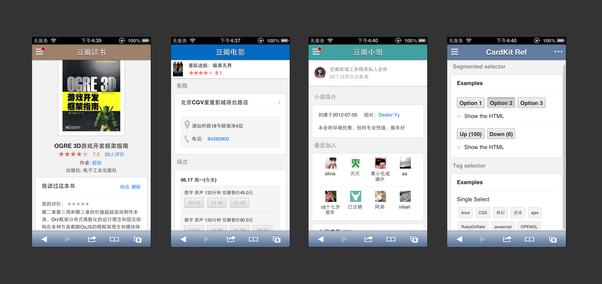

<!---
layout: intro
title: CardKit
-->

# CardKit

A mobile UI framework provides building blocks which are classified as "Card", "Unit" and "Component" to help you build mobile web apps quickly and simply, or transfer entire website to native-like web app for touch devices.

### Usages and Examples

[CardKit Reference App](http://ozjs.org/CardKit/refapp) (highly recommend to open in iOS/android device or simulator)

### In the Real World

### Unsupported Platform

* iOS 4.x or earlier
* Android 3.x or earlier
* Tablet device
* UC and similar browsers
* Some low-end phones
* iOS 7 support coming soon
* Windows Phone support coming soon

## Download

Compiled and packaged "all in one"  version:

* [dist/js/main.js](https://github.com/douban-f2e/CardKit/blob/master/dist/js/main.js)
* [dist/css/main.css](https://github.com/douban-f2e/CardKit/blob/master/dist/css/main.css)

Minified version:

* [dist/js/main.min.js](https://github.com/douban-f2e/CardKit/blob/master/dist/js/main.min.js)
* [dist/css/main.min.css](https://github.com/douban-f2e/CardKit/blob/master/dist/css/main.min.css)

or build your own:

## Quick Start for building

### Prepare the environment

1. node, npm
2. [grunt v0.4](http://gruntjs.com/getting-started) - `npm install grunt-cli -g`
3. [bower](http://bower.io/) - `npm install bower -g`
4. ruby, gem, [bundler](http://gembundler.com/)

### Install dependencies

1. `npm install`
2. `bundle install`
3. `bower install`
4. `grunt update`

### The first build

1. `cp config.js.tmpl config.js`
2. Resolve TODO in config.js
3. `grunt publish`

### Development

1. `grunt watch`
2. Edit source files in `js`, `css` and `tpl`

### Before committing

* `grunt` - small commits 
* `grunt publish` - version change (rebuild the distribution files)

## Docs & Demos

1. `grunt connect`
2. See [http://localhost:9100/](http://localhost:9001/) (or [official URL](http://ozjs.org/CardKit/refapp)) and `examples/`

More coming soon...

## Release History

See [changelog](https://github.com/douban-f2e/CardKit/wiki/Changelog)

## More References

[Mobileweb Instrumentality Project @ trello](https://trello.com/board/mobileweb-instrumentality-project/51357199230922201c0007ef)

## License

Copyright (c) 2013 douban.com
Licensed under the MIT license.

